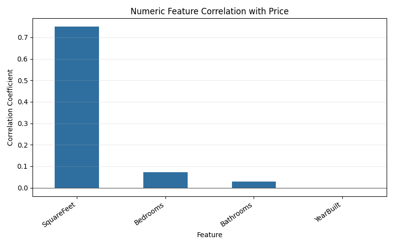
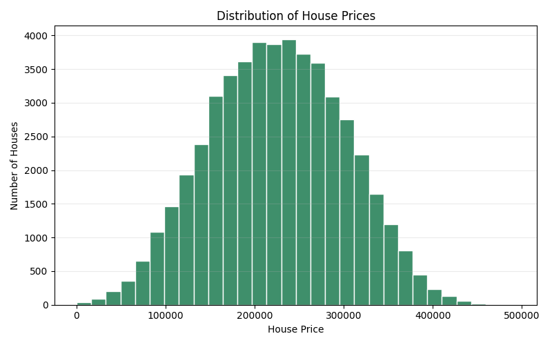
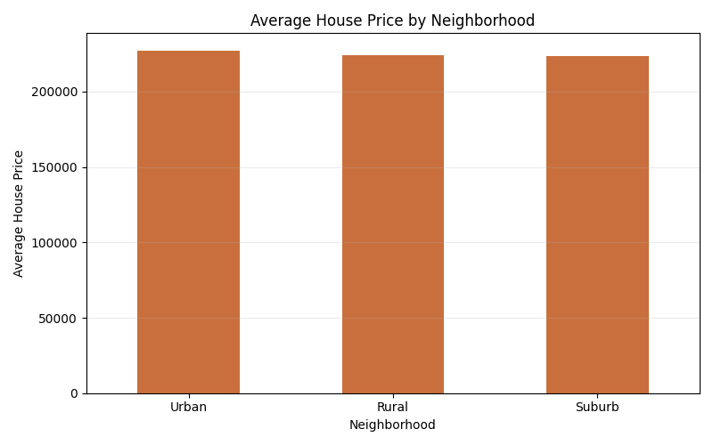
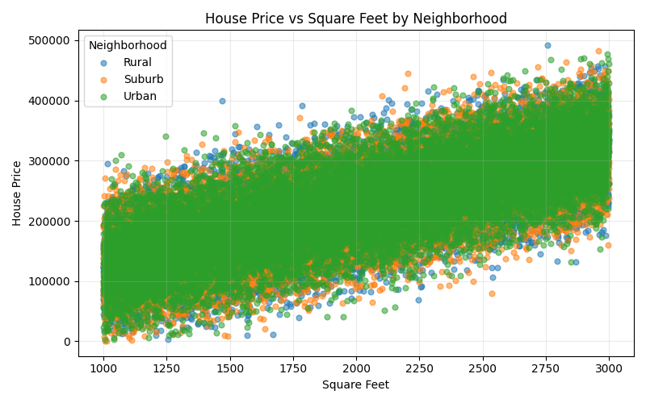
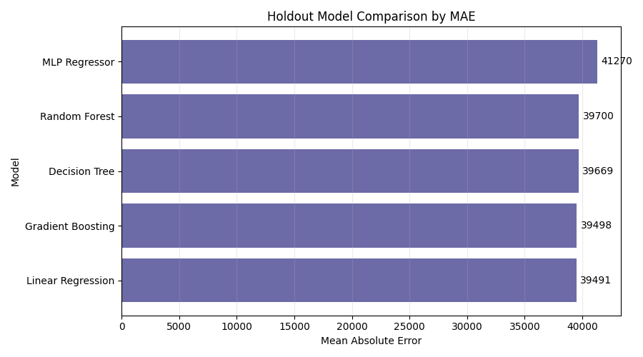
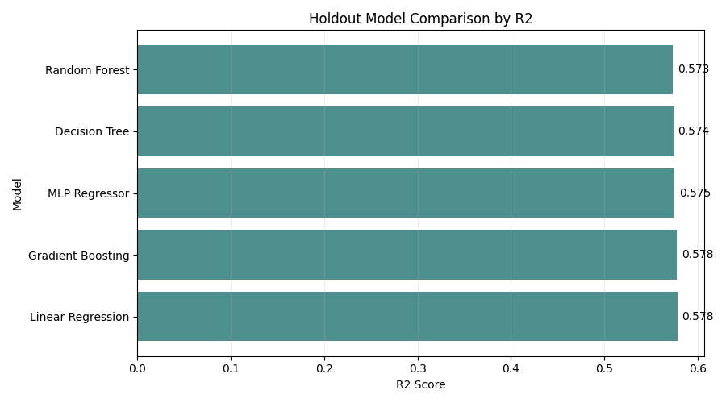
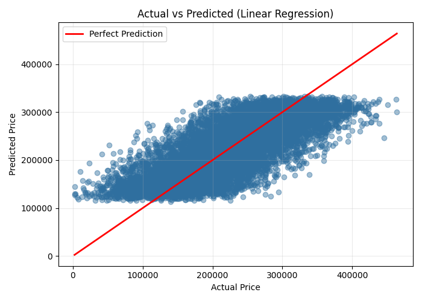

# Housing Price Graphs and Analysis

This report is generated from `data/raw/housing_price_dataset.csv` by the project pipeline.

## Dataset Summary

- Raw rows: 50,000
- Clean rows used for analysis: 49,978
- Columns: SquareFeet, Bedrooms, Bathrooms, Neighborhood, YearBuilt, Price
- Price range: $155 to $492,195
- Median price: $225,100
- Average price: $224,932

## Key Findings

- The best holdout model is **Linear Regression**, with MAE of $39,491 and R2 of 0.578.
- The strongest numeric relationship with price is **SquareFeet** with correlation 0.751.
- The highest average price neighborhood is **Urban** at $227,298.

## Generated Graphs

### Feature Correlation

### Price Distribution

### Average Price by Neighborhood

### Price vs Square Feet by Neighborhood

### Holdout Model MAE Comparison

### Holdout Model R2 Comparison

### Actual vs Predicted (Linear Regression)

## Feature Correlation

| Feature | Correlation with Price |
| --- | --- |
| SquareFeet | 0.751 |
| Bedrooms | 0.073 |
| Bathrooms | 0.028 |
| YearBuilt | -0.002 |

## Average Price by Neighborhood

| Neighborhood | count | mean | median | min | max |
| --- | --- | --- | --- | --- | --- |
| Urban | 16594 | 227297.86 | 227947.08 | 2697.85 | 476671.73 |
| Rural | 16668 | 224209.37 | 223775.12 | 3000.86 | 492195.26 |
| Suburb | 16716 | 223302.97 | 223731.77 | 154.78 | 482577.16 |

## Holdout Model Results

| Model | MAE | R2 |
| --- | --- | --- |
| Linear Regression | 39490.6903 | 0.5780 |
| Gradient Boosting | 39497.6751 | 0.5778 |
| Decision Tree | 39668.8460 | 0.5740 |
| Random Forest | 39699.6028 | 0.5730 |
| MLP Regressor | 41270.2952 | 0.5394 |

## Interpretation

The graphs show how price is distributed, how average price differs by neighborhood, and how square footage relates to price. The model comparison plots make it easier to compare error and explained variance across models. Lower MAE is better because it means smaller average pricing error, while higher R2 is better because it means the model explains more variation in prices.
